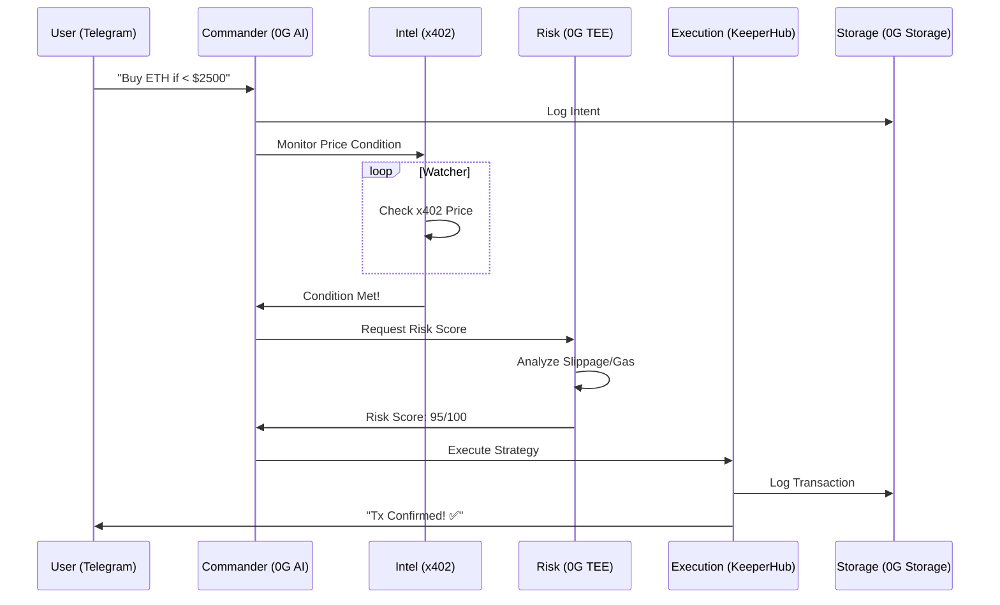

# Alpha402 — Autonomous DeFi Agent Crew

```text
       ___    __          __            __ __  ____ ___ 
      /   |  / /___  ____/ /_  ____ _  / // / / __ \__ \
     / /| | / / __ \/ __  / __ \/ __ `/ / // /_/ / / / __/
    / ___ |/ / /_/ / /_/ / / / / /_/ / /__  __/ /_/ / /_/ 
   /_/  |_/_/ .___/\__,_/_/ /_/\__,_/    /_/  \____/____/ 
           /_/                                            
```

> **Your autonomous trading crew, deployed in one message.**

[](https://ethglobal.com/showcase/shawarma-orchestrate-rfyhe)
[](https://sepolia.etherscan.io)
[](LICENSE)

---

## 💡 The Idea

# 🤖 Alpha402 — Telegram-Native Agentic Payment Gateway

Alpha402 is a specialized multi-agent crew that enables **autonomous agentic payments** and DeFi execution directly through Telegram. By combining **x402 payment rails** with **0G TEE-verified intelligence**, Alpha402 allows users to deploy autonomous financial swarms that can pay for their own resources, settle fees, and execute complex DeFi strategies without manual intervention.

### 🌟 The Core Value
The system solves the "Agentic Payment Problem": How can an AI agent autonomously settle a transaction or pay a service fee while remaining verifiable and decentralized? 

Through a single Telegram message, users deploy a crew that coordinates via a **Gensyn P2P mesh**, uses **0G Compute** for reasoning, and **KeeperHub** for guaranteed execution of **x402 payment flows**.

---

## 🚀 Key Features

- **Telegram-Native Intent:** No complex UIs. Deploy, monitor, and fund your agent swarm via a seamless chat interface.
- **Autonomous Agentic Payments:** Native integration with **x402** and **AgentPaymentManager** for automated fee settlement and reward distribution.
- **TEE-Verified Intelligence:** All payment logic and risk scoring are processed via **0G Compute Network** in Trusted Execution Environments.
- **Immutable Audit Trail:** Every agentic payment and communication is hashed and persisted to **0G Storage**.
nd even during gas spikes.

---

## 🏗️ Architecture & Flow

Alpha402 operates as a decentralized mesh of agents. Here is how the system components interact:

### 1. High-Level System Overview
```text
  ┌────────────────┐      ┌────────────────┐      ┌────────────────┐
  │  TELEGRAM BOT  │ ────▶│   COMMANDER    │ ────▶│   0G COMPUTE   │
  │  (User Intent) │      │  (Orchestrator)│      │  (AI Reasoning)│
  └────────────────┘      └───────┬────────┘      └────────────────┘
                                  │
                  ┌───────────────┴───────────────┐
                  ▼                               ▼
          ┌──────────────┐                ┌──────────────┐
          │    INTEL     │                │     RISK     │
          │  (x402 Feed) │                │  (TEE Scorer)│
          └───────┬──────┘                └───────┬──────┘
                  │                               │
                  └───────────────┬───────────────┘
                                  ▼
          ┌──────────────┐        │        ┌──────────────┐
          │  EXECUTION   │◀───────┘        │  0G STORAGE  │
          │ (KeeperHub)  │                 │ (Audit Log)  │
          └───────┬──────┘                 └──────────────┘
                  │
                  ▼
          ┌──────────────┐
          │  UNISWAP v4  │
          │ (On-Chain)   │
          └──────────────┘
```

### 2. Transaction Lifecycle (Sequence Diagram)



---

## 🤖 The Agent Crew

Each agent in Alpha402 has a specific role, identity (ENS), and logic:

### 🎯 **Commander** (`commander.alpha402.eth`)
The brain of the operation. 
- **Role:** Receives natural language from Telegram.
- **Logic:** Uses **0G Compute** (Llama-3 via TEE) to parse "intent" into a structured `Strategy` object (Target, Trigger, Action).
- **Orchestration:** Dispatches tasks to Intel and Risk agents.

### 📡 **Intel** (`intel.alpha402.eth`)
The eyes of the operation.
- **Role:** Market monitoring.
- **Logic:** Connects to **x402 Protocol** micropayment feeds to get real-time price data.
- **Action:** Triggers the pipeline when the price condition defined by the Commander is met.

### 🛡️ **Risk** (`risk.alpha402.eth`)
The conscience of the operation.
- **Role:** Verification & Safety.
- **Logic:** Performs a final check right before execution. Verifies slippage, checks gas costs, and ensures the wallet has sufficient balance.
- **Scoring:** Returns a confidence score. If < 80%, the trade is aborted.

### ⚡ **Execution** (`execution.alpha402.eth`)
The hands of the operation.
- **Role:** On-chain settlement.
- **Logic:** Routes the trade through **KeeperHub** for guaranteed execution.
- **DEX:** Performs swaps using **Uniswap v4** hooks for optimized routing.

---

## 🌐 The Infrastructure (P2P Mesh)

Agents don't just talk; they form a resilient mesh using **Gensyn AXL**.

```text
          [COMMANDER]
         /   (AXL)   \
        /             \
  [INTEL] ---------- [RISK]
        \   (AXL)     /
         \           /
          [EXECUTION]
```

- **Gensyn AXL:** Provides an encrypted P2P communication layer.
- **0G Storage:** Every A2A (Agent-to-Agent) message is hashed and stored on 0G, providing a permanent, immutable audit trail of the crew's decision-making process.

---

## 🚀 Getting Started

### Prerequisites
- **Node.js 20+**
- **pnpm 9+**
- **Environment Keys:** 0G API Key, Telegram Bot Token, Alchemy/Infura RPC URL.

### 1. Installation
```bash
git clone https://github.com/SamuelDharshi/Alpha402.git
cd Alpha402
pnpm install
```

### 2. Configuration
Copy `.env.example` to `.env` and fill in your keys:
```bash
cp .env.example .env
```
*Crucial keys: `TELEGRAM_BOT_TOKEN`, `ZG_API_KEY`, `SEPOLIA_RPC_URL`.*

### 3. Launching the System
Alpha402 requires three components to run in parallel:

```bash
# Terminal 1: The Agent Crew (The Backend)
npm run dev:agents

# Terminal 2: The Telegram Bot (The Interface)
npm run dev:bot

# Terminal 3: The Mission Control (The Dashboard)
npm run dev
```

---

## 🎮 How to Use

Once the system is running, follow these steps to deploy your first strategy:

1.  **Open Telegram:** Search for your bot (or `@Alpha402bot` if using the live demo).
2.  **Send Intent:** Type a command like:
    - `"Buy 0.1 ETH when the price drops below $2350"`
    - `"Sell my ETH if it goes above $2800"`
3.  **Confirm:** The Commander will reply with a structured summary of the strategy.
4.  **Monitor Dashboard:** Open `http://localhost:3000/dashboard`. You will see:
    -   **The Pipeline Graph:** Lights up as agents communicate.
    -   **Live Log:** See raw A2A messages being persisted to 0G Storage.
5.  **Execution:** Once the trigger hits, the Execution agent will post a transaction link to the chat.

---

## 🏗️ Hackathon Submission Coverage

### Sponsor Integrations
| Sponsor | Integration Detail |
|---|---|
| **0G Compute Network** | TEE-verified AI inference for Commander strategy parsing and Risk scoring |
| **0G Storage** | Every A2A message and strategy state persisted on-chain for audit trail |
| **Gensyn AXL** | P2P encrypted mesh for agent-to-agent communication |
| **ENS** | Agent identity layer: `commander.alpha402.eth`, `intel.alpha402.eth`, etc. |

## 🐝 Swarm Coordination (A2A)

Alpha402 operates as a **decentralized swarm**. Unlike traditional "master-slave" architectures, our agents coordinate via a stateless, event-driven mesh:
1.  **Transport:** All agents communicate via **Gensyn AXL** (P2P Mesh). If an agent goes offline, the bus automatically handles the message queue.
2.  **State Management:** The **Commander** acts as the orchestrator, but the **Intel** and **Risk** agents operate autonomously. They listen for specific message types (`INTEL_WATCHING`, `TRIGGER_FIRED`) and respond only when their specialized conditions are met.
3.  **Consensus:** Execution only occurs once the **Risk Agent** publishes a `RISK_APPROVED` message with a TEE-signed score, which the **Execution Agent** verifies on-chain.

## 🎨 iNFT & Embedded Intelligence

Each agent in the Alpha402 crew is registered as an **iNFT** on Sepolia (via the `AgentRegistry` contract). 
- **Proof of Identity:** The iNFT's `tokenURI` is a **0G Storage CID** (e.g., `0g://intel-metadata`).
- **Embedded Intelligence:** This metadata contains the agent's **System Prompt** and **Reasoning Model** configuration. By linking the iNFT to 0G Storage, we ensure that the agent's "brain" is persistent, decentralized, and verifiable. 

## 🛠️ SDKs & Features Used
- **0G Storage SDK:** `@0glabs/0g-ts-sdk` for immutable audit trails.
- **0G Compute SDK:** `@0gfoundation/0g-compute-ts-sdk` for TEE-verified AI inference.
- **Gensyn AXL:** Custom P2P transport layer for resilient swarm communication.
- **KeeperHub:** Direct Execution REST API for guaranteed trade settlement.
- **Uniswap v4:** Hook-based strategy enforcement on Sepolia.

## 🔗 Links to Key Files

- [README.md](README.md) — Main project overview
- [KEEPERHUB_GUIDE.md](KEEPERHUB_GUIDE.md) — KeeperHub integration write-up
- [FEEDBACK_KEEPERHUB.md](FEEDBACK_KEEPERHUB.md) — KeeperHub actionable feedback
- [FEEDBACK.md](FEEDBACK.md) — Uniswap v4 actionable feedback
- **Example Agents (The Swarm):**
  - [CommanderAgent.ts](agents/src/agents/commander/index.ts) — AI Orchestrator
  - [IntelAgent.ts](agents/src/agents/intel/index.ts) — Price Monitor (x402)
  - [RiskAgent.ts](agents/src/agents/risk/index.ts) — TEE Scorer (0G Compute)
  - [ExecutionAgent.ts](agents/src/agents/execution/index.ts) — KeeperHub Settler
- [AgentBus.ts](agents/src/bus/index.ts) — P2P Mesh (Gensyn) & Storage (0G)

### Links & Resources
- **Demo Video:** [🔴 Awaiting Link]
- **Live Dashboard:** [alpha402.vercel.app](https://alpha402.vercel.app/dashboard)
- **Smart Contracts:** [`0x7e4198E452921E32c30eeEfc9d58e63810b835D6`](https://sepolia.etherscan.io/address/0x7e4198E452921E32c30eeEfc9d58e63810b835D6)

### Team & Contact
- **Project Name:** Alpha402
- **Lead Developer:** Samuel Dharshi
- **Telegram:** @SamuelDharshi
- **X (Twitter):** @SamuelDharshi_
- **GitHub:** [SamuelDharshi/Alpha402](https://github.com/SamuelDharshi/Alpha402)

---

## 📜 License
MIT © 2026 Samuel Dharshi
