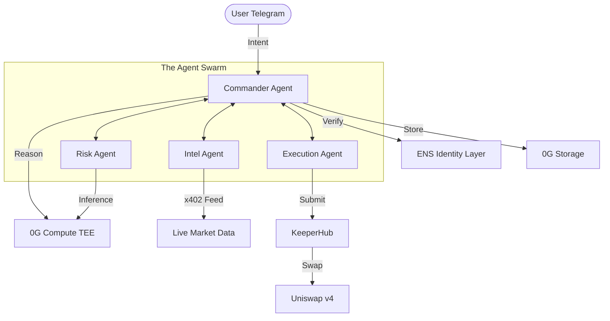
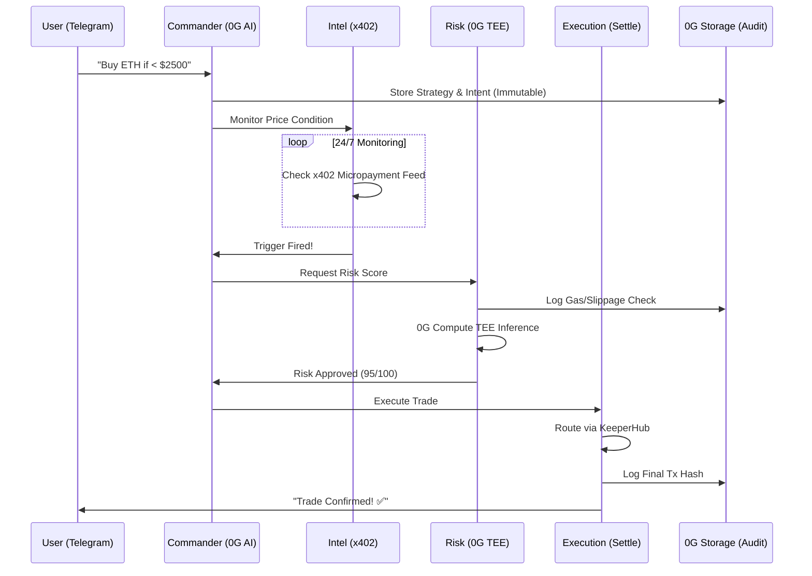

# Alpha402 — The First Verifiable Autonomous Agent Hub

```text
       ___    __          __            __ __  ____ ___ 
      /   |  / /___  ____/ /_  ____ _  / // / / __ \__ \
     / /| | / / __ \/ __  / __ \/ __ `/ / // /_/ / / / __/
    / ___ |/ / /_/ / /_/ / / / / /_/ / /__  __/ /_/ / /_/ 
   /_/  |_/_/ .___/\__,_/_/ /_/\__,_/    /_/  \____/____/ 
           /_/                                            
```

> **The Unstoppable Swarm: Verifiable Intelligence, Immutable Strategy, Guaranteed Execution.**

[](https://sepolia.etherscan.io)
[](https://0g.ai)
[](https://0g.ai/compute)
[](LICENSE)

---

## 💡 The Vision

**Alpha402** is a next-generation autonomous agent ecosystem designed to bridge the trust gap in decentralized finance. By combining **0G Compute** (TEE-verified intelligence) with **0G Storage** (immutable audit trails), we have built the first truly verifiable "Trading Crew" that operates 24/7 without human intervention.

Users deploy a specialized swarm of agents via a single Telegram message. This swarm handles everything from market monitoring and risk scoring to precision execution, all while maintaining a cryptographic record of every decision made.

---

## 🏗️ System Architecture

Alpha402 operates as a decentralized mesh of specialized agents. The system is designed for high resilience, using a P2P communication layer and on-chain identity verification.

### 1. High-Level Overview


### 2. The Verifiable Transaction Lifecycle


---

## 📉 The Market Pain Points

### 1. The "Trust Gap" in AI Agents
Most trading agents today are "black boxes." Users have no way to verify if an agent's decision was based on real data or if the agent was compromised. **Alpha402** solves this using **0G Compute (TEE)** to ensure that every risk assessment is performed in a secure enclave.

### 2. The Execution Audit Crisis
In high-frequency DeFi, tracking *why* a trade happened is as important as the trade itself. Traditional systems lose logs. **Alpha402** persists every agent-to-agent message to **0G Storage**, creating a permanent, immutable audit trail for every user strategy.

### 3. Manual Fatigue & Fragmentation
DeFi users are forced to manage 10+ tabs and set dozens of "dumb" price alerts. **Alpha402** collapses the entire stack — intent parsing, price watching, and execution — into a single, autonomous pipeline that costs less than a coffee to run.

---

## 🛠️ 0G Stack Integration (Deep Dive)

### 🧠 0G Compute: Verifiable Intelligence
We use the **0G Compute Network** to perform TEE-verified reasoning. The **Risk Agent** doesn't just guess; it runs a complex inference model within a Trusted Execution Environment to score trades based on live gas prices, slippage, and market volatility.

```typescript
// From agents/src/agents/risk/index.ts
private async run0GInference(strategyId: string, payload: any, gasPriceGwei: number) {
  console.log('[Risk] Calling 0G Compute Network for risk analysis (TEE-verified)...');
  const prompt = `Evaluate this trade: Price $${payload.currentValue}, Gas ${gasPriceGwei} gwei. 
                  Return JSON: {score: 1-10, verdict: "APPROVE" | "REJECT"}`;
  
  // Direct TEE-verified inference call
  const response = await callWithBroker([{ role: 'user', content: prompt }]);
  return JSON.parse(response.content);
}
```

### 💾 0G Storage: The Immutable Memory
Every communication between agents is hashed and uploaded to **0G Storage**. This ensures that if a user wants to audit their strategy weeks later, the evidence is cryptographically secured on-chain.

```typescript
// From agents/src/bus/index.ts
async publish(message: A2AMessage): Promise<void> {
  // Persist to 0G Storage (audit trail)
  this.zeroG.uploadJSON(message).then(res => {
    message.zeroGCID = res.cid; // Immutable Content ID
    message.zeroGTxn = res.tx;  // Transaction Hash on 0G
  });
  
  // Route to agent mesh...
}
```

---

## ⚡ Partner Ecosystem

### 🎯 KeeperHub: Guaranteed Settlement
We leverage **KeeperHub's Direct Execution API** to ensure that once a trade is approved by the Risk Agent, it is settled immediately on-chain. This eliminates the risk of "missing the dip" due to gas spikes or RPC failures.

```typescript
// From agents/src/agents/execution/index.ts
const res = await fetch(`${KEEPERHUB_BASE}/api/execute/check-and-execute`, {
  method: 'POST',
  headers: { 'Authorization': `Bearer ${apiKey}` },
  body: JSON.stringify({
    contractAddress: vaultAddress,
    functionName:    'authoriseExecution',
    action: {
      contractAddress: vaultAddress,
      functionName:    'executeChecked',
      functionArgs:    JSON.stringify([strategyId, token, amount, '0x']),
    }
  })
});
```

### 🦄 Uniswap v4: Precision Liquidity
All swaps are routed through **Uniswap v4** hooks. This allows our agents to execute trades with optimized routing and customized logic (e.g., dynamic fee adjustments based on Risk Agent scores).

---

## 🤖 The Agent Crew

Each agent in the swarm has a verified identity (ENS) and a specific role:

- **Commander** (`commander.alpha402.eth`): The orchestrator. Parses natural language and coordinates the swarm.
- **Intel** (`intel.alpha402.eth`): The observer. Monitors market conditions via high-frequency micropayment feeds.
- **Risk** (`risk.alpha402.eth`): The validator. Uses 0G TEE to ensure every trade is safe and efficient.
- **Execution** (`execution.alpha402.eth`): The settler. Finalizes trades via KeeperHub and Uniswap v4.

---

## 🎮 Guide for Judges & Users

### 1. Instant Deployment
Clone and install dependencies in seconds:
```bash
git clone https://github.com/SamuelDharshi/Alpha402.git
cd Alpha402
pnpm install
cp .env.example .env
```

### 2. Launch the Swarm
The system runs in three layers. Open three terminals:
```bash
# Terminal 1: The AI Brain (Agents)
npm run dev:agents

# Terminal 2: The Interface (Telegram Bot)
npm run dev:bot

# Terminal 3: The Mission Control (Web Dashboard)
npm run dev
```

### 3. Your First Trade
1.  Open your Telegram Bot.
2.  Send: `"Buy 0.01 ETH if the price hits $2400."`
3.  Watch the **Commander** parse your intent.
4.  Open the Dashboard (`localhost:3000`) to see the **0G Storage** CIDs appearing in real-time as agents talk.

---

## 🔗 Deployment Details (Sepolia)

| Contract | Address |
|---|---|
| **StrategyVault** | `0xf840458FF5d911701a2092c693B0442E4B33089C` |
| **AgentPaymentManager** | `0xFceb11FB0093984e1c930964197B632D029a43b8` |
| **AgentRegistry (iNFT)** | `0x2E0A3D2411de73D457E6970a338C494D2b340462` |
| **Alpha402Hook** | `0x7e4198E452921E32c30eeEfc9d58e63810b835D6` |

---

## 📜 License
MIT © 2026 Samuel Dharshi
