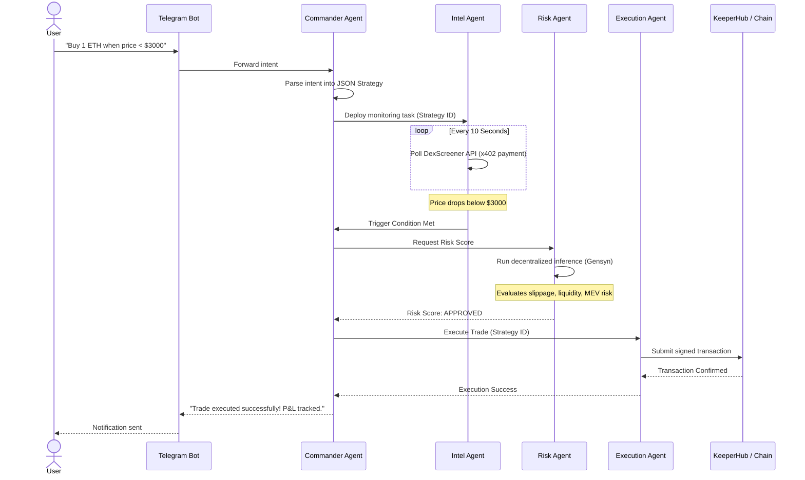

# Alpha402

Alpha402 is an autonomous multi-agent DeFi trading system built for the ETHGlobal Open Agents 2026 hackathon. It utilizes a crew of specialized AI agents to execute intent-based trading strategies on Uniswap v4 via Unichain, leveraging cutting-edge sponsor technologies for storage, communication, and execution.

## 🚀 Overview

The Alpha402 platform allows users to deploy a personalized fleet of AI agents using natural language. Instead of manually monitoring charts and worrying about MEV extraction, users simply message the Telegram bot (e.g., "Buy 1 ETH when the price dips below $3000"). The agent crew handles the rest: watching price feeds 24/7, scoring the risk of the trade, and executing the transaction securely.

### Core Features

- **Intent-Based Trading:** Define strategies in plain English via Telegram.
- **Multi-Agent Orchestration:** A specialized crew (Commander, Intel, Risk, Execution) handles parsing, monitoring, risk assessment, and execution.
- **DeFi Execution:** Integrates with Uniswap v4 hooks for precise trading.
- **Cyberpunk 3D Dashboard:** A visually stunning React Three Fiber (R3F) dashboard to monitor your agents' activity and x402 micropayments in real-time.

## 🛠️ Technology Stack

- **Frontend:** Next.js 14, TailwindCSS, React Three Fiber (R3F), Zustand
- **Backend/Agents:** Node.js, `tsx`, ethers.js, Groq SDK
- **Blockchain/Infrastructure:**
  - **Unichain:** Target network for low-latency DeFi execution.
  - **0G Storage:** Decentralized logging and state persistence for agents.
  - **Gensyn AXL:** P2P mesh communication layer between agents.
  - **KeeperHub:** Reliable, MEV-protected transaction execution.
  - **Uniswap v4:** Trading and liquidity hooks.

## 🤖 Multi-Agent Workflow Sequence

The system operates through a coordinated sequence of agent interactions:



## 🏗️ Project Structure

- `frontend/`: The Next.js 14 Web3 dashboard with a fully interactive 3D command center.
- `agents/`: The backend agent crew logic, managing the AXL P2P mesh and LLM inference.
- `bot/`: The Telegram bot interface for interacting with the system.
- `contracts/`: Hardhat workspace for custom Uniswap v4 hooks and Alpha402 payment contracts.
- `shared/`: Shared TypeScript types, utility functions, and constants.

## 🏃 Getting Started

### Prerequisites
- Node.js (v20+)
- npm

### Installation
1. Clone the repository:
   ```bash
   git clone https://github.com/SamuelDharshi/Alpha402.git
   cd Alpha402
   ```
2. Install dependencies:
   ```bash
   npm install
   ```
3. Set up environment variables:
   ```bash
   cp .env.example .env
   # Fill in the required keys in .env
   ```

### Running the Project locally
The system is managed from the root directory using npm workspaces.

1. **Start the Agent Backend:**
   ```bash
   npm run dev:agents
   ```
   *(This starts the Commander, Intel, Risk, and Execution agents and exposes the WebSocket server on port 3001).*

2. **Start the Frontend Dashboard:**
   In a new terminal window:
   ```bash
   npm run dev
   ```
   *(The dashboard will be available at `http://localhost:3000`).*

3. **Start the Telegram Bot (Optional):**
   ```bash
   npm run dev:bot
   ```

## 📜 License
MIT
